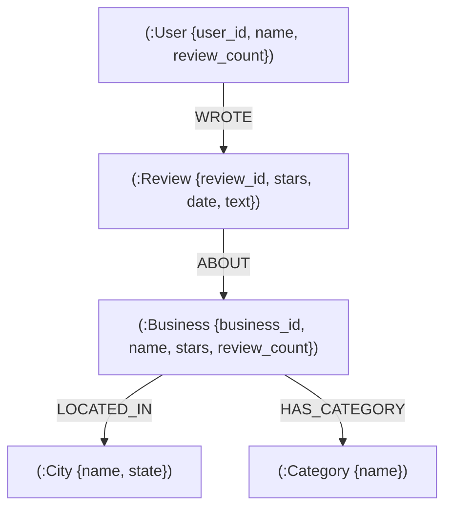

# Graph Data Model — LocalGraph (CognoDB / Neo4j)

## 1. Node Types & Properties

| Node Label | Key Property (ID) | Additional Properties | Description |
| :--- | :--- | :--- | :--- |
| `Business` | `business_id` (String) | `name`, `address`, `city`, `state`, `postal_code`, `latitude`, `longitude`, `stars`, `review_count`, `is_open` | Local establishment listed on Yelp |
| `User` | `user_id` (String) | `name`, `review_count`, `average_stars`, `fans`, `yelping_since` | Registered Yelp reviewer |
| `Review` | `review_id` (String) | `stars`, `useful`, `funny`, `cool`, `text`, `date` | Written evaluation submitted by a user for a business |
| `Category` | `category_id` (String) | `name` | Industry or business classification (e.g. Restaurants, Coffee) |
| `City` | `city_id` (String) | `name`, `state` | Geographic location of businesses |

---

## 2. Relationship Types

| Relationship | Source Node | Target Node | Properties | Graph Semantics |
| :--- | :--- | :--- | :--- | :--- |
| `WROTE` | `User` | `Review` | None | Indicates a user authored a review |
| `ABOUT` | `Review` | `Business` | None | Connects a review to the evaluated business |
| `LOCATED_IN` | `Business` | `City` | None | Places a business within a municipality |
| `HAS_CATEGORY` | `Business` | `Category` | None | Maps a business to one of its category tags |

---

## 3. Mermaid Graph Diagram



---

## 4. Key Graph Traversal Patterns

### A. Core Feature: Similar Business Recommendation (2-Hop / 4-Edge Traversal)
Finds businesses visited and reviewed by users who also reviewed the target business ($B_A$).

```cypher
MATCH (b:Business {business_id: $business_id})<-[:ABOUT]-(r1:Review)<-[:WROTE]-(u:User)-[:WROTE]->(r2:Review)-[:ABOUT]->(rec:Business)
WHERE rec.business_id <> $business_id
RETURN rec.business_id AS business_id,
       rec.name AS name,
       rec.stars AS stars,
       rec.review_count AS review_count,
       rec.city AS city,
       rec.address AS address,
       count(DISTINCT u) AS shared_reviewers,
       round(avg(r2.stars), 2) AS avg_shared_rating
ORDER BY shared_reviewers DESC, rec.stars DESC
LIMIT $limit
```

### B. Multi-Hop Category & Community Discovery (3+ Hop Traversal)
Traverses `Business A -> Category -> Business B <- Review <- User -> Review -> Business C` to find community-validated complementary businesses within shared category clusters.

```cypher
MATCH (b:Business {business_id: $business_id})-[:HAS_CATEGORY]->(cat:Category)<-[:HAS_CATEGORY]-(b2:Business)<-[:ABOUT]-(r1:Review)<-[:WROTE]-(u:User)-[:WROTE]->(r2:Review)-[:ABOUT]->(b3:Business)
WHERE b.business_id <> b3.business_id AND b2.business_id <> b3.business_id
RETURN b3.business_id AS business_id,
       b3.name AS name,
       cat.name AS matched_category,
       count(DISTINCT u) AS connected_users,
       round(avg(b3.stars), 2) AS rating
ORDER BY connected_users DESC, rating DESC
LIMIT $limit
```

---

## 5. Why Graph Database vs Relational (SQL)
In a relational database (PostgreSQL/MySQL), computing co-review recommendations requires joining 4 massive tables (`businesses`, `reviews`, `users`, `reviews`, `businesses`) with `GROUP BY` and heavy table scans. As review rows scale into millions, SQL `JOIN` performance degrades exponentially ($O(N^k)$).

In CognoDB (openCypher/Neo4j graph database), connections are stored as direct physical memory pointers (Index-Free Adjacency). Traversing from `Business -> Review -> User -> Review -> Business` is an $O(1)$ local pointer lookup per edge, completing in milliseconds regardless of total graph size.
