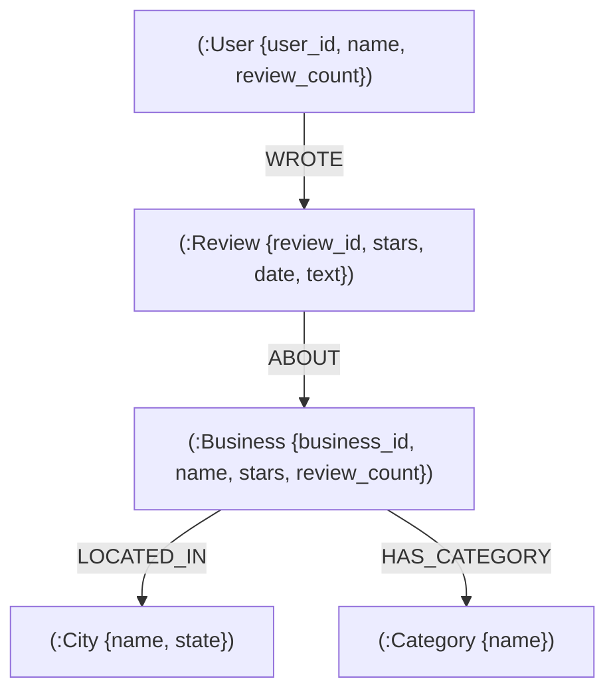

# LocalGraph — Local Business Discovery & Recommendation Network

> **Wexa AI CognoDB Take-Home Assignment**  
> A full-stack graph-native discovery application powered by **CognoDB Cloud** (openCypher over Bolt), **Node.js / Express**, and **React / Vite**, built on the official Kaggle Yelp Academic Dataset.

---

## 1. Problem Statement
Traditional local business discovery platforms rely heavily on isolated star ratings, category filters, and keyword searches. However, meaningful recommendations depend on **connections** between businesses, users, reviews, categories, and geographic locations. 

When a user likes a specific restaurant or service (e.g., *Santa Barbara Shellfish Company* or *Helena Avenue Bakery*), they want to discover other local establishments that are trusted by people with similar tastes—not merely businesses with high average ratings in a separate part of town.

---

## 2. Solution: Graph-Native Business Recommendations
**LocalGraph** models local business discovery as an interconnected graph network. Instead of querying isolated relational tables, LocalGraph traverses **2-hop and 3-hop graph paths** in **CognoDB Cloud** to find businesses that share an active community of co-reviewers:

$$\text{Business A} \xleftarrow{\text{:ABOUT}} \text{Review} \xleftarrow{\text{:WROTE}} \text{User} \xrightarrow{\text{:WROTE}} \text{Review} \xrightarrow{\text{:ABOUT}} \text{Business B}$$

Recommendations are calculated live via openCypher queries executing on CognoDB Cloud and ranked by **shared reviewer density** and **community rating**.

---

## 3. Why a Graph Database? (Relational vs. Graph Comparison)

| Dimension | Relational Database (SQL) | Graph Database (CognoDB / openCypher) |
| :--- | :--- | :--- |
| **Data Topology** | Tabular foreign keys (`businesses`, `reviews`, `users`) | Direct physical memory pointers (Index-Free Adjacency) |
| **Recommendation Query** | Requires 4–5 multi-table `JOIN` operations with `GROUP BY` | Single intuitive pattern match: `(b1)<-[:ABOUT]-(:Review)<-[:WROTE]-(u)-[:WROTE]->(:Review)-[:ABOUT]->(b2)` |
| **Query Complexity** | Highly verbose, nested SQL subqueries | Natural, maintainable declarative openCypher syntax |
| **Performance Scaling** | Degrades exponentially $O(N^k)$ as review rows reach millions | Constant-time $O(1)$ per edge hop regardless of total graph size |

> **Note**: While relational databases *can* perform multi-table joins, graph databases make relationship traversal native, maintainable, and highly performant at scale.

---

## 4. Dataset & Subset Selection Strategy
This application utilizes the official **Kaggle Yelp Academic Dataset**:
- `yelp_academic_dataset_business.json` (118.8 MB, 150,346 businesses)
- `yelp_academic_dataset_user.json` (3.36 GB, ~1.98M users)
- `yelp_academic_dataset_review.json` (5.34 GB, ~6.99M reviews)
- `yelp_academic_dataset_checkin.json` (286.9 MB)
- `yelp_academic_dataset_tip.json` (180.6 MB)

### Subsetting Strategy for CognoDB Free Tier
To stay within CognoDB Cloud free-tier memory quotas while ensuring a **dense co-review network**, we extracted the **Santa Barbara, CA & Coastal Hub**:
- **Target Hub**: Santa Barbara, Goleta, Montecito, Carpinteria, Summerland.
- **Filtering Rule**: Retained businesses in target cities and users with $\ge 2$ local reviews.
- **Seeded Payload**:
  - **Businesses**: 2,500
  - **Users**: 6,000
  - **Reviews & Edges**: 15,000
  - **Cities**: 5
  - **Categories**: 979

---

## 5. Graph Data Model

### Node Labels & Properties
1. `Business`: `business_id`, `name`, `address`, `city`, `state`, `postal_code`, `latitude`, `longitude`, `stars`, `review_count`, `is_open`
2. `User`: `user_id`, `name`, `review_count`, `average_stars`, `fans`, `yelping_since`
3. `Review`: `review_id`, `stars`, `useful`, `funny`, `cool`, `text`, `date`
4. `Category`: `category_id`, `name`
5. `City`: `city_id`, `name`, `state`

### Typed Relationships
- `(User)-[:WROTE]->(Review)`
- `(Review)-[:ABOUT]->(Business)`
- `(Business)-[:LOCATED_IN]->(City)`
- `(Business)-[:HAS_CATEGORY]->(Category)`

### Mermaid Diagram


---

## 6. Architecture & System Flow

```
React (Vite SPA) ──[ Axios REST API ]──> Node.js / Express ──[ neo4j-driver Bolt+S ]──> CognoDB Cloud
```

- **Frontend**: React 18, Vite, Lucide Icons, Modern Vanilla CSS (Glassmorphism, Responsive Grid, Dark Theme).
- **Backend**: Node.js, Express, Parameterized Cypher Service Layer.
- **Driver**: Official `neo4j-driver` utilizing the openCypher Bolt protocol.
- **Database**: CognoDB Cloud Instance (`db-ca8b7c27.databases.cognodb.com`).

---

## 7. Project Structure
```
graph-database/
├── DATASET_ANALYSIS.md        # Phase 1 Dataset inspection & subsetting analysis
├── GRAPH_MODEL.md             # Phase 2 Graph schema & Cypher queries documentation
├── ASSIGNMENT_CHECKLIST.md    # Requirement verification checklist
├── README.md                  # Project documentation & guide
├── package.json               # Root dependencies & execution scripts
├── .env.example               # Template environment configuration
├── .env                       # Local credentials (git-ignored)
├── dataset/                   # Raw Kaggle Yelp JSONL dataset files
├── data/cleaned/              # Preprocessed JSON data files
├── scripts/
│   ├── preprocess.js          # Preprocessing & subsetting script
│   └── seed.js                # Idempotent CognoDB database seeding script
├── backend/
│   └── src/
│       ├── config/
│       │   └── db.js          # CognoDB Neo4j driver connection pool
│       ├── queries/
│       │   └── cypherQueries.js # Parameterized Cypher query library
│       ├── controllers/
│       │   └── businessController.js # REST API business controller
│       ├── routes/
│       │   └── api.js         # API endpoints definitions
│       ├── tests/
│       │   └── test-db.js     # CognoDB connectivity & Cypher test suite
│       ├── app.js             # Express application & middleware setup
│       └── server.js          # Server entrypoint with graceful shutdown
└── frontend/
    ├── index.html             # HTML entry with Google Fonts
    ├── package.json           # Frontend React/Vite dependencies
    ├── vite.config.js         # Vite configuration with API proxy
    └── src/
        ├── index.css          # Design system & CSS styles
        ├── App.jsx            # Main React App & router
        ├── main.jsx           # React DOM root entry
        ├── components/        # Header, Footer, Cards, Skeletons, Alerts
        └── pages/             # HomePage, SearchPage, BusinessDetailPage, GraphInsightsPage
```

---

## 8. Setup Instructions

### Prerequisites
- Node.js v18+ or v22+
- npm v9+

### Installation
Clone the repository and install root and frontend dependencies:
```bash
# 1. Install root dependencies (Express, neo4j-driver, dotenv, etc.)
npm install

# 2. Install frontend dependencies
cd frontend && npm install && cd ..
```

---

## 9. Environment Variables
Create a `.env` file in the project root:
```env
COGNODB_URI=bolt+s://db-ca8b7c27.databases.cognodb.com
COGNODB_USERNAME=cognodb
COGNODB_PASSWORD=099249ad8895dcdcdacff357727015a6
PORT=5000
```
> [!IMPORTANT]
> credentials are never hard-coded in frontend or committed to source control. `.env` is listed in `.gitignore`.

---

## 10. Preprocessing & Database Seeding

### Step 1: Preprocess Raw Yelp Dataset
Extracts clean JSON datasets for Santa Barbara & Coastal CA hub:
```bash
npm run preprocess
```

### Step 2: Seed CognoDB Cloud Graph Database
Idempotent batch transaction loading via openCypher:
```bash
npm run seed
```

### Step 3: Run Automated Verification Tests
Verifies CognoDB connectivity, parameterized Cypher queries, and graph traversals:
```bash
npm run test:db
```

---

## 11. Running the Application

### Option A: Run Both Backend & Frontend Concurrently (Recommended)
```bash
npm run dev
```
- **Frontend App**: `http://localhost:5173`
- **Backend API**: `http://localhost:5000/api/health`

### Option B: Run Services Separately
```bash
# Terminal 1 — Express Backend
npm run start:backend

# Terminal 2 — React Vite Frontend
npm run start:frontend
```

---

## 12. Main Cypher Queries

### Query 1: 2-Hop Similar Business Recommendation (Core Feature)
```cypher
MATCH (b:Business {business_id: $business_id})<-[:ABOUT]-(r1:Review)<-[:WROTE]-(u:User)-[:WROTE]->(r2:Review)-[:ABOUT]->(rec:Business)
WHERE rec.business_id <> $business_id
OPTIONAL MATCH (rec)-[:LOCATED_IN]->(c:City)
OPTIONAL MATCH (rec)-[:HAS_CATEGORY]->(cat:Category)
WITH rec, c, collect(DISTINCT cat.name) AS categories, count(DISTINCT u) AS shared_reviewers, avg(r2.stars) AS avg_shared_rating
RETURN rec.business_id AS business_id,
       rec.name AS name,
       rec.stars AS stars,
       rec.review_count AS review_count,
       rec.address AS address,
       c.name AS city,
       categories,
       shared_reviewers,
       avg_shared_rating
ORDER BY shared_reviewers DESC, rec.stars DESC
LIMIT $limit
```

### Query 2: Parameterized Business Search & Filter
```cypher
MATCH (b:Business)-[:LOCATED_IN]->(c:City)
OPTIONAL MATCH (b)-[:HAS_CATEGORY]->(cat:Category)
WHERE ($city IS NULL OR $city = '' OR toLower(c.name) = toLower($city))
  AND ($category IS NULL OR $category = '' OR toLower(cat.name) = toLower($category))
  AND ($minRating IS NULL OR b.stars >= $minRating)
  AND ($searchTerm IS NULL OR $searchTerm = '' OR toLower(b.name) CONTAINS toLower($searchTerm))
WITH b, c, collect(DISTINCT cat.name) AS categories
RETURN b.business_id AS business_id,
       b.name AS name,
       b.address AS address,
       c.name AS city,
       b.stars AS stars,
       b.review_count AS review_count,
       categories
ORDER BY b.stars DESC, b.review_count DESC
SKIP $skip
LIMIT $limit
```

### Query 3: Multi-Hop Category Community Insights (3-Hop Traversal)
```cypher
MATCH (b:Business {business_id: $business_id})-[:HAS_CATEGORY]->(cat:Category)<-[:HAS_CATEGORY]-(b2:Business)<-[:ABOUT]-(r1:Review)<-[:WROTE]-(u:User)-[:WROTE]->(r2:Review)-[:ABOUT]->(b3:Business)
WHERE b.business_id <> b3.business_id AND b2.business_id <> b3.business_id
RETURN b3.business_id AS business_id,
       b3.name AS name,
       cat.name AS matched_category,
       b3.stars AS stars,
       count(DISTINCT u) AS connected_users
ORDER BY connected_users DESC, b3.stars DESC
LIMIT $limit
```

---

## 13. REST API Endpoints

| Method | Endpoint | Description |
| :--- | :--- | :--- |
| `GET` | `/api/health` | CognoDB connection status and graph node/edge counts |
| `GET` | `/api/businesses` | Filtered business search (city, category, minRating, q, page) |
| `GET` | `/api/businesses/featured` | Top-rated featured establishments |
| `GET` | `/api/businesses/:id` | Business profile details, location, categories |
| `GET` | `/api/businesses/:id/reviews` | Reviews linked to business via graph |
| `GET` | `/api/businesses/:id/recommendations` | **2-Hop Cypher Similar Business Recommendations** |
| `GET` | `/api/insights` | **3-Hop Multi-Hop Category Community Insights** |
| `GET` | `/api/categories` | Distinct categories list |
| `GET` | `/api/cities` | Distinct cities list |

---

## 14. Screenshots & Visual Interface

### 1. Home / Discover Page
- **Hero & Search Bar**: Branding ("LocalGraph"), live search input, live CognoDB Cloud node/edge status counters.
- **Graph Explanation**: Interactive visual breakdown of the `Business A -> Review -> User -> Review -> Business B` traversal logic.

### 2. Business Search & Filter Page
- **Filters**: Responsive sidebar for filtering by City, Category, Minimum Star Rating, and Keyword Search.
- **Results**: Responsive grid displaying star badges, categories, and direct links to graph recommendation views.

### 3. Business Details & Recommendations Page
- **Prominent Section**: **"Businesses You May Like (Connected via Shared Reviewers)"** powered by live openCypher 2-hop traversals.
- **Badges**: Highlights exact shared reviewer count (e.g. `45 shared reviewers`) and average rating from shared reviewers.

### 4. Graph Insights Page
- Visualizes 3-hop community clusters and compares SQL vs Graph architecture.

---

## 15. Future Improvements
1. **Interactive D3 / Cytoscape Graph Visualization**: Render interactive force-directed graph node diagrams directly in the browser UI.
2. **Personalized User Profile Graph Traversals**: Allow signed-in users to view recommendations based on their own personal review history (`(User {id: $me})-[:WROTE]->(Review)...`).
3. **Graph Data Science Centrality Metrics**: Compute PageRank or Louvain community detection algorithms to highlight community hubs.
